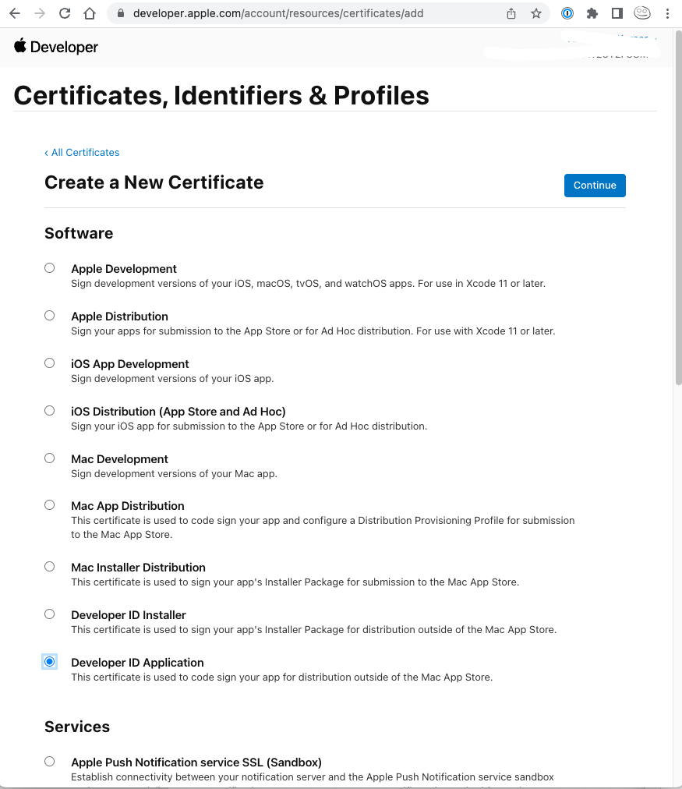
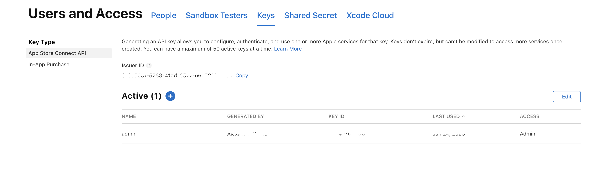
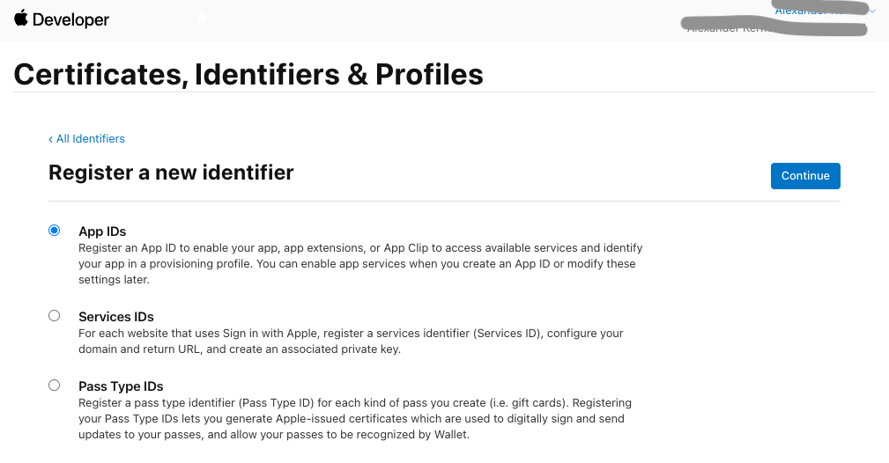
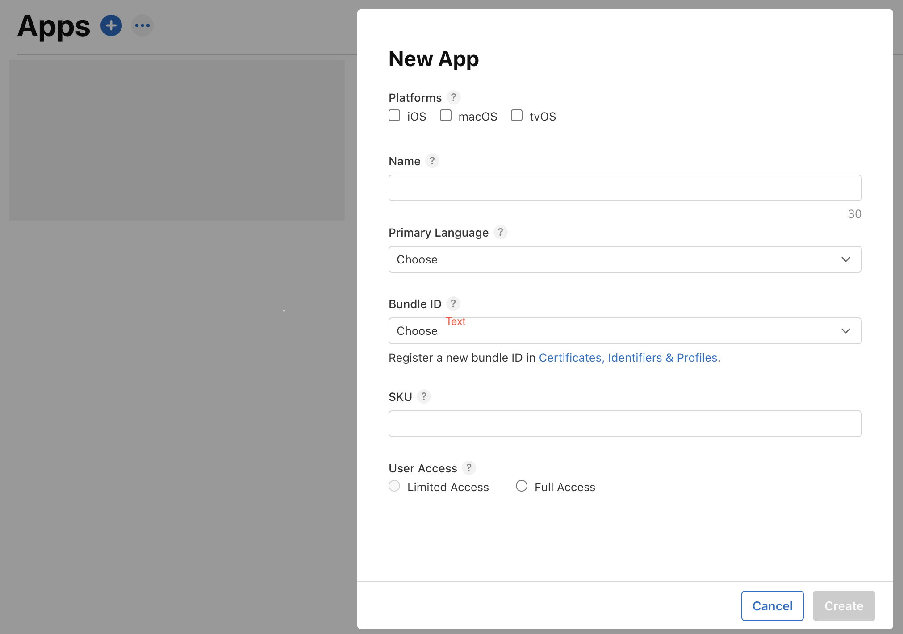

# Code-sign Java for macOS

[](https://github.com/drrename/codesign-java-for-mac/actions/workflows/build.yml) [](https://github.com/drrename/codesign-java-for-mac/blob/master/LICENSE)

[](https://sonarcloud.io/summary/new_code?id=Tools1000_codesign-java-for-mac)
[](https://sonarcloud.io/summary/new_code?id=Tools1000_codesign-java-for-mac)
[](https://sonarcloud.io/summary/new_code?id=Tools1000_codesign-java-for-mac)
[](https://sonarcloud.io/summary/new_code?id=Tools1000_codesign-java-for-mac)

Tools for packging, code-signing and notarization of Java applications for Apple macOS, Windows and Linux.

## Requirements

### Windows

+ .NET Framework 3.5
+ https://wixtoolset.org/docs/wix3/

## Library

[](https://maven-badges.herokuapp.com/maven-central/io.github.drrename.codesignjava/codesignjava)

### Features

+ Wrapper for [Jlink](https://docs.oracle.com/javase/9/tools/jlink.htm)
+ Wrapper for [JPackage](https://docs.oracle.com/en/java/javase/14/docs/specs/man/jpackage.html)
+ Wrapper for [xcrun notarytool](https://keith.github.io/xcode-man-pages/notarytool.1.html)
+ Wrapper for [codesign](https://www.manpagez.com/man/1/codesign/)

## Maven Plugin

[](https://maven-badges.herokuapp.com/maven-central/io.github.drrename.codesignjava/codesignjava-maven-plugin)

Integrate packaging, codesigning and notarizing with your Maven build.

### For latest usage examples, see the following projects

+ [Dr.Kodi](https://github.com/DrRename/drkodi)

### Usage

Add the following configurations to your `pom.yml`:

```xml
<plugin>
 <groupId>org.apache.maven.plugins</groupId>
 <artifactId>maven-dependency-plugin</artifactId>
 <executions>
     <execution>
         <id>copy-mods</id>
         <phase>prepare-package</phase>
         <goals>
             <goal>copy-dependencies</goal>
         </goals>
         <configuration>
             <overWriteIfNewer>true</overWriteIfNewer>
             <includeScope>runtime</includeScope>
             <includeGroupIds>${modularGroupIds}</includeGroupIds>
             <outputDirectory>${project.build.directory}/mods</outputDirectory>
         </configuration>
     </execution>
     <execution>
         <id>copy-libs</id>
         <phase>prepare-package</phase>
         <goals>
             <goal>copy-dependencies</goal>
         </goals>
         <configuration>
             <overWriteIfNewer>true</overWriteIfNewer>
             <includeScope>runtime</includeScope>
             <excludeGroupIds>${modularGroupIds}</excludeGroupIds>
             <outputDirectory>${project.build.directory}/libs</outputDirectory>
         </configuration>
     </execution>
 </executions>
</plugin>
```

This will configure your build to copy and separate all dependencies to the following two paths:

`{project.build.directory}/libs` and `{project.build.directory}/mods`.

Specify filtering using the `{modularGroupIds}` property:

```xml
<modularGroupIds>org.openjfx</modularGroupIds>
```

In this example, JavaFX mods will go to `mods`, all other dependencies will go to `libs`.


```xml
<profile>
   <id>macosx-aarch64</id>
   <properties>
       <javafx.platform>mac-aarch64</javafx.platform>
   </properties>
   <build>
       <finalName>${project.artifactId}-${javafx.platform}</finalName>
       <plugins>
           <plugin>
               <groupId>io.github.drrename.codesignjava</groupId>
               <artifactId>codesignjava-maven-plugin</artifactId>
               <version>2.0.5</version>
               <executions>
                   <execution>
                       <id>default</id>
                       <goals>
                           <goal>package-and-codesign</goal>
                       </goals>
                   </execution>
               </executions>
               <configuration>
                   <jreModuleNames>java.desktop, java.base,java.logging, java.xml, java.scripting, java.compiler,
                       java.instrument, jdk.unsupported, javafx.base, javafx.graphics,
                       javafx.controls,javafx.fxml, java.sql, java.naming
                   </jreModuleNames>
                   <jreModules>${project.build.directory}/mods</jreModules>
                   <applicationModulesPath>${project.build.directory}/libs</applicationModulesPath>
                   <appVersion>1.0.0</appVersion>
                   <moduleName>Name</moduleName>
                   <packageIdentifier>com.name</packageIdentifier>
                   <moduleStarter>module-name/LauncherClass</moduleStarter>
                   <developerId>${MAC_DEVELOPER_ID}</developerId>
                   <apiKey>${MAC_API_KEY_ID}</apiKey>
                   <apiIssuer>${MAC_API_ISSUER_ID}</apiIssuer>
               </configuration>
           </plugin>
       </plugins>
   </build>
</profile>
```

+ Valid values for `javafx.platform` are `linux`, `linux-aarch64`, `mac`, `mac-aarch64`, `win`, `win-x86`. For more details, see [here](https://stackoverflow.com/questions/75006480/javafx-maven-platform-specific-build-mac-aarm64-qualifier).

+ Currently, you need to specify required modules explicitly with `jreModuleNames`. See [Issue 14](https://github.com/DrRename/codesign-java-for-mac/issues/14).

+ You need to specify modules that should be bundled together with the JRE via `jreModules`. A typical use case would be JavaFX mods.
+ Modules and libraries that should be bundled with your app are specified with `applicationModulesPath`.
+ for developerId, apiKey and apiIssuer, please see [Secrets] (#Secrets) section.

## Further Reading

### JPackage

+ https://docs.oracle.com/en/java/javase/16/jpackage/

### HowTo Code-signing and Notarization for macOS

#### Tell Apple about yourself and your App

1. Register as a developer at [developer.apple.com](https://developer.apple.com/).

2. Go to [developer.apple.com/account/resources/certificates/list](https://developer.apple.com/account/resources/certificates/list) and create a new Certificate:

   

3. Go to [appstoreconnect.apple.com/access/api](https://appstoreconnect.apple.com/access/api)
   and create a developer API key.

   

   You will need the "Issuer ID" and the "KEY ID" later for the notarization.

   **Important**: Download the API key, that is only possible once right after creation of the key! You will need it later.

   create folder `.private_keys` in home and move `*.p8` file there: `mkdir -p ~/private_keys; cp *.p8 ~/.private_keys`

4. Go to [developer.apple.com/account/resources/certificates/list](https://developer.apple.com/account/resources/certificates/list)
   and register a new identifier for the app.

   

5. Go to [appstoreconnect.apple.com/apps](https://appstoreconnect.apple.com/apps)
   and register a new App with the created identifier.

   

#### Codesign your App

##### On `codesign --deep`

On [developer.apple.com/forums/thread/128166](https://developer.apple.com/forums/thread/128166) they write:

> Do not use the --deep argument. This feature is helpful in some specific circumstances but it will cause problems when signing a complex program.

See here [developer.apple.com/forums/thread/129980](https://developer.apple.com/forums/thread/129980) for more info.

##### GitHub Actions

1. Download your certificate.

2. Convert to base64 string and copy it to your clipboard: `base64 -i Developer\ ID\ Application\ John\ Doer\ \(12345ABCDE\).p12 | pbcopy`

3. Create a repository variable and paste the base64 string:

   

4. Create another variable and paste your password:

   

#### Notarize your App

##### Submit notarization request

`xcrun altool --notarize-app --primary-bundle-id "com.drkodi" --apiKey "ABCDE12345" --apiIssuer "3a8a0000-5288-41dd-8527-b0000000028a" -t osx -f DrKodi.app.zip --output-format json`

**Note**: trying to upload an .app file will fail. Instead, zip it first and upload the zip file.

##### Query for results

`xcrun altool --notarization-info 'cb00ab00-b46b-424a-b0dd-d4f7f9111147' --primary-bundle-id "com.drkodi" --apiKey "ABCDE12345" --apiIssuer "3a8a0000-5288-41dd-8527-b0000000028a" --output-format json`

#### GitHub Actions

##### Secrets

Go to https://github.com/DrRename/drkodi/settings/secrets/actions and create repository/ organisation secrets.

###### Developer ID, -certificate and -password.

1. `MAC_DEVELOPER_ID` this should hold the name of your Apple developer certificate. For example, `Developer ID Application: John Doe (12345ABCDE)`. Note that there are different certificates for different purposes. See https://developer.apple.com/account/resources/certificates/add for more details.
2. `MAC_DEVELOPER_CERTIFICATE` this is the actual certificate. You need to export your certificate from your keychain into a base64 string that can be passed on via a GitHub secret. See https://docs.github.com/en/actions/deployment/deploying-xcode-applications/installing-an-apple-certificate-on-macos-runners-for-xcode-development and https://help.apple.com/xcode/mac/current/#/dev154b28f09 for more details.
3.  During certificate export, you will need to provide a password. Store it in another organisation/ repository variable. Call it `MAC_DEVELOPER_CERTIFICATE_PASSWORD` for example.

###### Apple App Store Connect Keys

Go to https://appstoreconnect.apple.com/access/api and create a new key as described above. Like before, we need the key name/ id, and the key itself. A password is not required here.

1. `MAC_API_KEY_ID` the name of the API key. Identical to `KEY ID` on the _App Store Connect_ page.
2. `MAC_API_KEY` the key itself. Again, it is supposed to be a base64 string. Transform and copy to clipboard with the following command: `base64 -i .private_keys/AuthKey_12345ABCDE.p8 | pbcopy`.
3. `MAC_API_ISSUER_ID` the key `Issuer ID`. Identical to Issuer ID on the _App Store Connect_ page. 

###### One more secret

1. `KEYCHAIN_PASSWORD`: _A new keychain will be created on the runner, so the password for the new keychain can be any new random string. In this example, the secret is named `KEYCHAIN_PASSWORD`._ From the docs (https://docs.github.com/en/actions/deployment/deploying-xcode-applications/installing-an-apple-certificate-on-macos-runners-for-xcode-development).

## Sources and additional information

+ [github.com/Apple-Actions/upload-testflight-build/issues/27](https://github.com/Apple-Actions/upload-testflight-build/issues/27)
+ [docs.github.com/en/actions/deployment/deploying-xcode-applications/installing-an-apple-certificate-on-macos-runners-for-xcode-development](https://docs.github.com/en/actions/deployment/deploying-xcode-applications/installing-an-apple-certificate-on-macos-runners-for-xcode-development)
